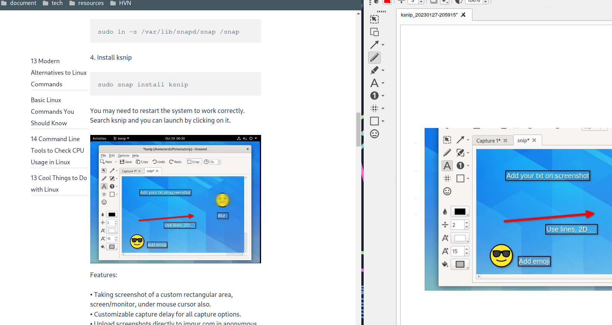

Th 6, 27 thg 1, 2023
AWS - global_infrastructures (1)
AWS:aws, Vọc link tinh:voc-link-tink
Bài viết chém gió về AWS global infrastructure, nào là data center, availability zones, regions, etc ...

***Ở tuần đầu tiên trong lộ trình học AWS của mình, chúng ta sẽ làm quen với kiến trúc global của nó trước.***

Global infrastructure của AWS bao gồm:
- AWS - Data Center
- AWS - Availablility Zones
- AWS - Regions
- AWS - Local Zones
- AWS - Wavelength Zones

**Nhiều vl**

### AWS - Data Center

