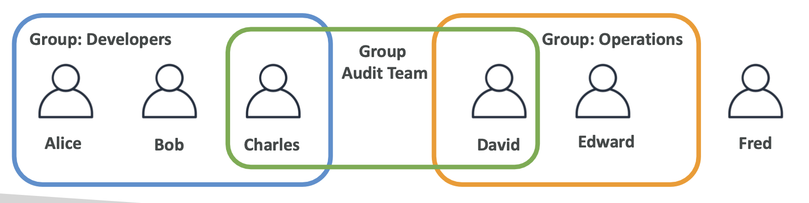
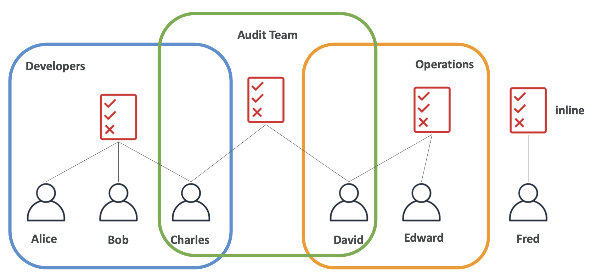

Chu Nhat, 12 thg 2, 2023
AWS - IAM (Identity and Access Management)
AWS:aws
Bài viết giới thiệu về AWS IAM (Identity and Access Management)

AWS IAM Section
---
---

### AWS IAM: Users and Groups

- __IAM__ = Identity and Access Management, (Global service)
- __Root account__ được tạo mặc định khi create AWS account
- __Users__ là những tài khoản được tạo từ __Root Account__ của bạn, thuộc __Organization__ của bạn, có thể được group lại
- __Groups__ chỉ chứa các users, không chứa groups khác
- __Users__ không nhất thiết phải thuộc về 1 nhóm, và user có thể thuộc về nhiều nhóm




### AWS IAM: Permissions

- __Policies__ Là tập hợp các định nghĩa về __Permissions__ của users
- __Users or Groups__ Có thể được gán __Permissions__ thông qua __Policies__
- Nên áp dụng ___least privilege principle___: chỉ cấp những quyền mà users cần

```json
{
    "Version": "2012-10-17",
    "Statement": [
        {
            "Sid": "AllowEc2DescribeAndIamListUsers",
            "Effect": "Allow",
            "Action": [
                 "ec2:Describe*",
                 "iam:ListUsers"
            ],
            "Resource": "*"
        }
    ]
}
```
*Policy ở trên cung cấp quyền ec2:Describe\* và iam:ListUsers*

IAM Policies Inheritance




